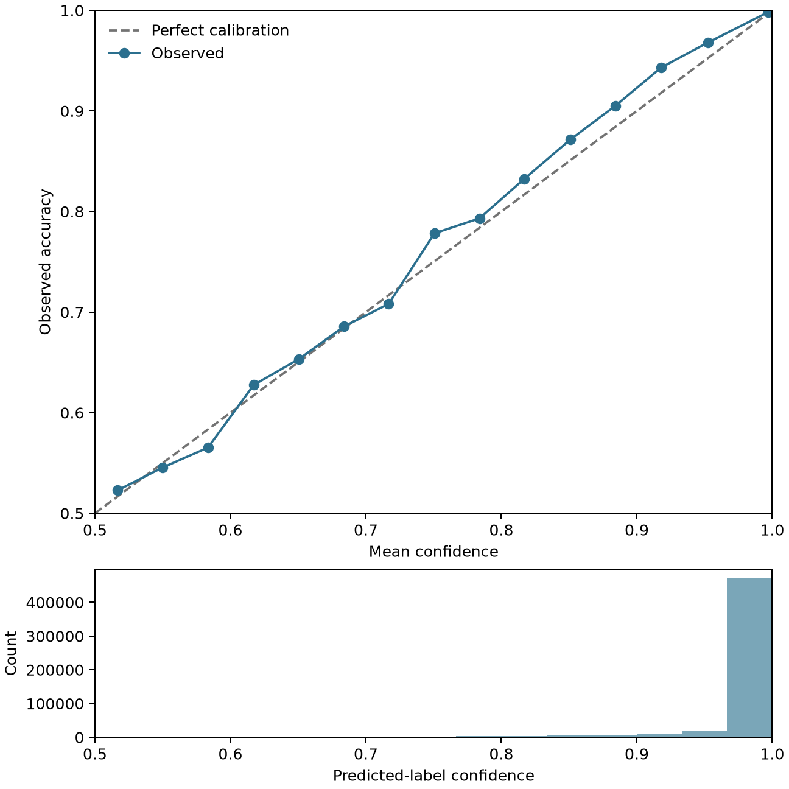
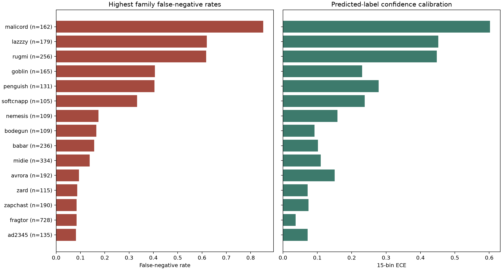

# Corrected calibration results

The released EMBER2024 PE LightGBM detector was evaluated once on the reviewed
540,000-row preparation. Every value below was independently recalculated from
the aligned labels and probabilities with NumPy, pandas, and scikit-learn.

## Aggregate results

| Metric | Value |
| --- | ---: |
| Accuracy at `p >= 0.5` | 0.9803222222 |
| ROC AUC | 0.9981880554 |
| Brier score | 0.0147949965 |
| 15-bin ECE | 0.0030850838 |
| 15-bin MCE | 0.0277246070 |

Calibration uses the class predicted at `p >= 0.5`, confidence
`max(p, 1-p)`, and equal-width `[0.5,1.0]` bins. Intervals are left-closed and
right-open except the final interval, which includes 1.0.



## Family-specific failures

Yes—strong aggregate calibration hides family-specific failures. The primary
comparison includes 232 upstream families with at least 100 malicious records,
covering 198,854 malicious rows. The largest false-negative rates are:

| Family | Malicious count | False-negative rate | 15-bin ECE |
| --- | ---: | ---: | ---: |
| malicord | 162 | 0.851852 | 0.602358 |
| lazzzy | 179 | 0.620112 | 0.452050 |
| rugmi | 256 | 0.617188 | 0.447200 |
| goblin | 165 | 0.406061 | 0.230170 |
| penguish | 131 | 0.404580 | 0.278403 |
| softcnapp | 105 | 0.333333 | 0.237920 |
| nemesis | 109 | 0.174312 | 0.158870 |
| bodegun | 109 | 0.165138 | 0.091964 |
| babar | 236 | 0.156780 | 0.101922 |
| midie | 334 | 0.137725 | 0.110136 |

Family ECE measures predicted-label confidence calibration within a
malicious-only family group. Because every included label is malicious, family
false-negative rate is exactly `1 - accuracy`. Labels are kept exactly as
provided upstream; inspection found no whitespace or case variants to merge.



## Sensitivity

| Bins | Aggregate ECE | Aggregate MCE | Primary top-10 family-ECE overlap |
| ---: | ---: | ---: | ---: |
| 10 | 0.002967793 | 0.023373977 | 10/10 |
| 15 | 0.003085084 | 0.027724607 | 10/10 |
| 20 | 0.003177991 | 0.029541059 | 10/10 |
| 30 | 0.003227550 | 0.035004511 | 10/10 |

Aggregate calibration remains strong across the four bin counts, and the
top-10 family-ECE set is unchanged.

| Minimum malicious count | Eligible families | Eligible malicious rows | FNR top-10 overlap | ECE top-10 overlap |
| ---: | ---: | ---: | ---: | ---: |
| 50 | 394 | 210,067 | 6/10 | 6/10 |
| 100 | 232 | 198,854 | 10/10 | 10/10 |
| 200 | 128 | 184,149 | 3/10 | 3/10 |

Eligibility and the most extreme family rankings change with the minimum-count
rule. Comparisons based on smaller family counts are less stable and should not
be read as precise population estimates.

Of 270,000 malicious rows, 37,633 have null family values. Among the remaining
232,367 rows, 3,554 families totaling 33,513 rows fall below the primary minimum.
Null, blank, `unknown`, `none`, and `nan` values are excluded case-insensitively;
in this preparation all unusable values were null.

The reviewed preparation retains 60 hashes repeated across weeks. They have no
label, family, file-type, or detector-input conflicts.

## Reproduction

```bash
python scripts/analyze_results.py \
  --inference-manifest results/inference/inference_manifest.json \
  --output-dir results/analysis \
  --threshold 0.5 \
  --bins 15 \
  --minimum-family-count 100 \
  --sensitivity-bins 10,15,20,30 \
  --sensitivity-family-minimums 50,100,200
```

The analysis manifest records implementation commit
`c63e5548d6c1eab93e57b99e292d1af68fa31318`, input hashes, parameters,
dependency versions, and output hashes.

## Limitations and future work

These are descriptive subgroup results and do not establish causation. Family
labels are upstream labels, 60 hashes repeat across weeks, and no unique-hash
sensitivity or confidence interval was calculated. The minimum-count analysis
shows that subgroup rankings depend on eligibility.

The previous SHAP pipeline used EMBER2018 samples and a separately trained
Random Forest, so it did not explain the evaluated released model. Corrected
SHAP was intentionally not run, and SHAP does not support these findings.
Possible future work includes corrected SHAP, confidence intervals, and
post-hoc calibration fitted only on a separate calibration split.

This repository is maintained by Tara Dixit.
